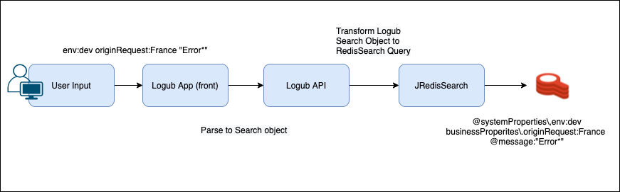
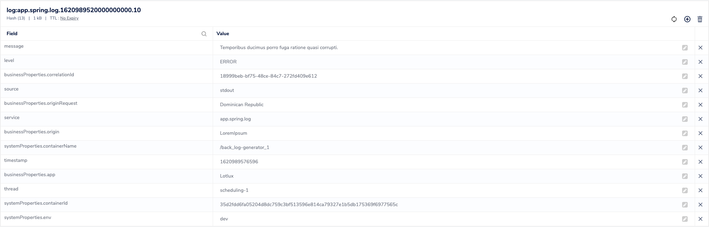
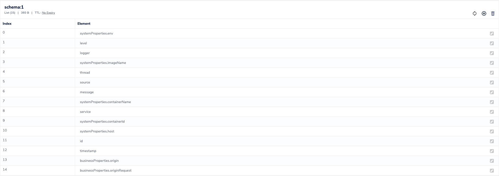

# Logub

Logub is an application to collect, explore and analyze application logs.
Proudly powered by Redis for log storage and RediSearch for the exploration and analysis part.

<p align="center">
<a href="https://raw.githubusercontent.com/Logub/logub/main/images/home-advanced-filter.png"></a>
</p>
<p align="center">
<a href="https://github.com/Logub/logub/blob/main/images/log-details-popup.png?raw=true"></a>
</p>

<br/>
<br/>

## Architecture

Logub Architecture Diagram :

<p align="center">
<a href="https://github.com/Logub/logub/blob/main/images/architecture.png?raw=true"></a>
</p>

<br/>
<br/>

## How it works ?

Logub use [Fluentd](https://www.fluentd.org) to collect, format and send logs to Redis. The Logub backend then allows to interact with the logs, to do full text search and to index some fields defined by the user (with RediSearch).

### How data are stored ?

### How data are queried ?

```JAVA
public class LogubLog {
  @Builder.Default
  private String id = UUID.randomUUID().toString();

  @Builder.Default
  private String index = "principal";

  @NonNull
  private SystemProperties systemProperties;

  @Builder.Default
  private Map<String, Object> businessProperties = Collections.emptyMap();

  @Builder.Default
  private Optional<String> message = Optional.empty();

  @Builder.Default
  private Instant timestamp = Instant.now();

  @Builder.Default
  private Optional<String>  service = Optional.empty();

  @Builder.Default
  private Optional<String> logger = Optional.empty();

  @Builder.Default
  private Optional<String> thread = Optional.empty();
  @Builder.Default
  private Optional<String> source = Optional.empty();
  @Builder.Default
  private LogLevel level = UNKNOWN;
}

public class SystemProperties {
 @Builder.Default
 Optional<String> imageName = Optional.empty();

 @Builder.Default
 Optional<String>  containerName= Optional.empty();
 @Builder.Default
 Optional<String>  containerId= Optional.empty();

 @Builder.Default
 Optional<String>  env= Optional.empty();

 @Builder.Default
 Optional<String>  host= Optional.empty();

}


```
This is the object we use in order to manipulate logs and retrieve it from the database to allow the Logub UI to display the logs. In order to make complexe query on our logs we use Redis Search on the top of the redis database. As we have added the possibility for the user to change the redis search schema dynamically, we used the "List" data structure in order to keep track of which schema is indexed.

```JAVA
public class LogSearch {

  @Builder.Default
  private List<LogubFieldSearch> texts = emptyList();
  @Builder.Default
  private List<LogubFieldSearch> systemProperties = emptyList();
  @Builder.Default
  private List<LogubFieldSearch> businessProperties = emptyList();

  @Builder.Default
  private List<LogubFieldSearch> basicProperties = emptyList();

  @Builder.Default
  private List<LogubFieldSearch> levels = Collections.emptyList();
  @Builder.Default
  private int limit = 25;
  @Builder.Default
  private int offset = 0;
  @Builder.Default
  private Optional<LogubSort> sort = Optional.empty();
  @Builder.Default
  private Instant beginAt = Instant.now().minus(15, ChronoUnit.MINUTES);
  @Builder.Default
  private Instant endAt = Instant.now();


  @SneakyThrows
  public QueryBuilder toQuery() {
    var query = new QueryBuilder();
    var businessPrefix = "businessProperties.";
    var systemPropertiesPrefix = "systemProperties.";
    for (LogubFieldSearch properties : businessProperties) {
      query.append(QueryBuilders.tag(businessPrefix + properties.getName(), properties.getValues(),
          properties.isNegation()));
    }
    for (LogubFieldSearch properties : systemProperties) {
      query.append(QueryBuilders
          .tag(systemPropertiesPrefix + properties.getName(), properties.getValues(),
              properties.isNegation()));
    }
    for (LogubFieldSearch properties : basicProperties) {
      query.append(QueryBuilders
          .tag(properties.getName(), properties.getValues(),
              properties.isNegation()));
    }
    if (!levels.isEmpty()) {
      for (LogubFieldSearch level : levels) {
        var onError = !level.getValues().stream().allMatch(v -> Arrays.stream(LogLevel.values())
            .anyMatch(enumLevel -> enumLevel.name().equalsIgnoreCase(v)));
        if(onError){
          log.error("bad payload for levels {}", level);
          throw new IllegalArgumentException("bad payload for level");
        }
        query.append(QueryBuilders.tag("level",level.getValues(), level.isNegation()));
      }
    }
    for (LogubFieldSearch text : texts) {
      if(!text.getType().equals(LogubFieldType.FullText)){
        log.warn("type {} not handle for text search", text.getType());
      }
      for (String value : text.getValues()) {
        query.append(QueryBuilders.text("message", value, text.isNegation()));
      }
    }

    return query;
  }


}
```
This is the object which allow us to create a plain text redis search query based on the user input. As you can see we create our own (small) QueryBuilders on the top of the JRedisSearch Libary. It's this object that will be send by Logub UI in order to make powerfull search in your logs.
<br/>
<br/>

## How to run it locally ? (DEMO)

### Prerequisites

- Docker - v20.10
- Docker Compose - v1.29
- NodeJS 12+ and NPM 6+

### Launch Logub server

- Go to `/back` folder (`cd ./back`)  
- Launch the docker-compose with the given command:

```
docker-compose up -d
```

### Launch Logub UI

- Go to `/frontend` folder (`cd ./frontend`)
- Start the UI with the following command:

```
npm start
```

## How to integrate it to your project ?

You can integrate Logub to your project. For now, Logub is only available in Docker environment.
You will need three Docker images :

- Logub fluentd image to collect and send logs to Redis (LINK)
- Redis image with RediSearch module (LINK)
- Logub backend image to serve log exploring functionnalities

#### Logub log format

For now, Logub can handle one particular log format described here. In the future, this format will be extended and more customizable.

Format : JSON
PUT EXAMPLE + ENV VARIABLES FOR BUSINESS PROPS
## How Redis are used in this Project ?
### Redis Search
Logub uses the functionality of Redisearch to process application logs. When logs are persisted in the Redis database, they are accompanied by 3 types of fields.
- SystemProperties are the information that fluentd gives us when sending the logs, like the environment, the container name and many others.
- BasicProperties which are the basic information that a log have (eg: timestamp, level, service, loggerName or the message)
  
These properties are automatically indexed in RedisSearch.
- The Business properties, which are given by the user of logub in a specific field we ask the user to give which respect the Key - Value (Map) format. 
  We use the dynamic index of redis search in order to allow the user to index these "custom properties" if he wants to do some research on it.

```
{"timestamp":"2021-05-14 11:01:11.686","level":"WARN","thread":"scheduling-1",
"mdc":{"app":"Toughjoyfax","correlationId":"521f075f-36be-4f85-957e-d1c87ad71aa8","originRequest":"Tonga","origin":"LoremIpsum"},
"logger":"com.loghub.loggenerator.service.LoggerService","message":"Doloremque dolores ut minima sed."}
```

Here we have an example of log which describe how our tools works, when fluentd flattent and persist it in the redis database,
the service we called "log-controller" will retrieve these data in the `POST logs/search`. At the top of the library 'JRedisSearch' we build our QueryBuilder in order to create RedisSearch query based on our model.
This makes it easier to search the logs, while using the power of Redis Search.
The Logub API allow user or company to index one or all field of the mdc object.

In this project the ***Tag Datatype*** are widely used. As we can see from our experiences we often search logs based on business properties when search in logs (eg: a customer id).
Furthermore, we also use the ***TextField Datatype*** for the log messages, that allow the user to do full text search on this field.

Here are a simplified schema of the search process


### Redis 
As we say before redis in used in order to store our logs by fluentd like this in the ***Hash type*** of Redis.

In order to keep track of the indexed field by the user we also add a "schema" object which use the ***List type*** of Redis

