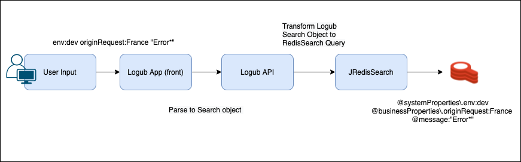

# Logub

Logub is an application to collect, explore and analyze application logs.
Proudly powered by Redis for log storage and RediSearch for the exploration and analysis part.

<p align="center">
<a href="https://github.com/Logub/logub/blob/main/images/home-advanced-filter.png?raw=true"></a>
</p>
<p align="center">
<a href="https://github.com/Logub/logub/blob/main/images/log-details-popup.png?raw=true"></a>
</p>

<br/>
<br/>

## Architecture

Logub Architecture Diagram :

<p align="center">
<a href="https://github.com/Logub/logub/blob/main/images/architecture.png?raw=true"></a>
</p>

<br/>
<br/>

## How it works ?

Logub use [Fluentd](https://www.fluentd.org) to collect, format and send logs to Redis. The Logub backend then allows to interact with the logs, to do full text search and to index some fields defined by the user (with RediSearch).

### How data are stored ?

Map ?

### How data are queried ?

RediSearch, indexation...

<br/>
<br/>

## How to run it locally ? (DEMO)

### Prerequisites

- Docker - v20.10
- Docker Compose - v1.29
- NodeJS 12+ and NPM 6+

### Launch Logub server

- Go to `/back` folder (`cd ./back`)  
- Launch the docker-compose with the given command:

```
docker-compose up -d
```

### Launch Logub UI

- Go to `/frontend` folder (`cd ./frontend`)
- Start the UI with the following command:

```
npm start
```

## How to integrate it to your project ?

You can integrate Logub to your project. For now, Logub is only available in Docker environment.
You will need three Docker images :

- Logub fluentd image to collect and send logs to Redis (LINK)
- Redis image with RediSearch module (LINK)
- Logub backend image to serve log exploring functionnalities

#### Logub log format

For now, Logub can handle one particular log format described here. In the future, this format will be extended and more customizable.

Format : JSON
PUT EXAMPLE + ENV VARIABLES FOR BUSINESS PROPS
## How Redis are used in this Project ?
### Redis Search
Logub uses the functionality of Redisearch to process application logs. When logs are persisted in the Redis database, they are accompanied by 3 types of fields.
- SystemProperties are the information that fluentd gives us when sending the logs, like the environment, the container name and many others.
- BasicProperties which are the basic information that a log have (eg: timestamp, level, service, loggerName or the message)
  
These properties are automatically indexed in RedisSearch.
- The Business properties, which are given by the user of logub in a specific field we ask the user to give which respect the Key - Value (Map) format. 
  We use the dynamic index of redis search in order to allow the user to index these "custom properties" if he wants to do some research on it.

```
{"timestamp":"2021-05-14 11:01:11.686","level":"WARN","thread":"scheduling-1",
"mdc":{"app":"Toughjoyfax","correlationId":"521f075f-36be-4f85-957e-d1c87ad71aa8","originRequest":"Tonga","origin":"LoremIpsum"},
"logger":"com.loghub.loggenerator.service.LoggerService","message":"Doloremque dolores ut minima sed."}
```

Here we have an example of log which describe how our tools works, when fluentd flattent and persist it in the redis database,
the service we called "log-controller" will retrieve these data in the `POST logs/search`. At the top of the library 'JRedisSearch' we build our QueryBuilder in order to create RedisSearch query based on our model.
This makes it easier to search the logs, while using the power of Redis Search.
The Logub API allow user or company to index one or all field of the mdc object.

In this project the ***Tag Datatype*** are widely used. As we can see from our experiences we often search logs based on business properties when search in logs (eg: a customer id).
Furthermore, we also use the ***TextField Datatype*** for the log messages, that allow the user to do full text search on this field.

Here are a simplified schema of the search process


### Redis 
As we say before redis in used in order to store our logs by fluentd like this in the ***Hash type*** of Redis.

In order to keep track of the indexed field by the user we also add a "schema" object which use the ***List type*** of Redis

